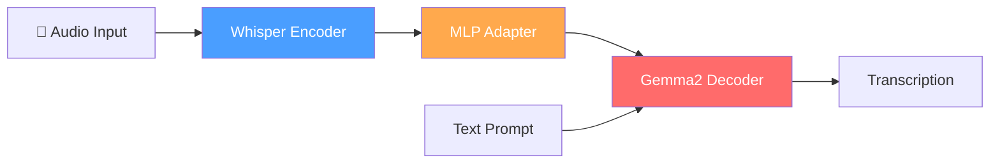
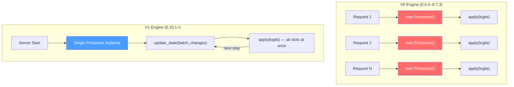
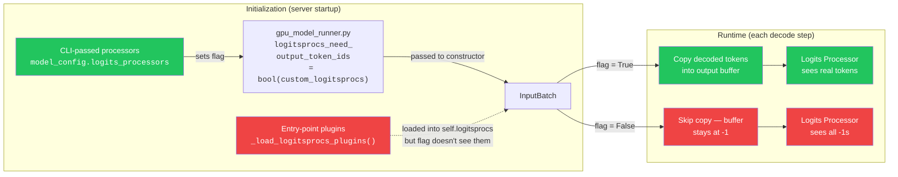

# Migrating an AudioLLM from vLLM 0.6 to 0.16: A War Story

> **TL;DR:** vLLM's V1 entry-point logits processors silently receive `-1`
> placeholder tokens instead of real output when `repetition_penalty=1.0`.
> The bug is in `gpu_model_runner.py`: it computes
> `bool(custom_logitsprocs)` from the CLI-only list and passes the result
> to `InputBatch`, never accounting for entry-point plugins loaded by
> `build_logitsprocs()`. We found it after two days chasing a FlashInfer
> red herring. Short monkey-patch fix included. Affects vLLM V1 with async scheduling (the default for all standard
> executor backends, including single- and multi-GPU deployments).

> We're developers on the MERaLiON team who built a vLLM plugin for
> [MERaLiON-2](https://huggingface.co/MERaLiON/MERaLiON-2-10B), a
> Gemma2-based AudioLLM for multilingual speech recognition. Over the past
> year, we migrated the plugin from vLLM 0.6.5 to 0.16.0 — across 3 plugin
> versions, 2 engine architectures, and 10+ breaking API changes. This is
> what we learned.

---

## 1. Why a Plugin?

MERaLiON-2 is an AudioLLM: a Whisper audio encoder fused with a Gemma2 text
decoder.



vLLM doesn't ship with native support for this architecture, but its
plugin system lets you register custom models without forking the framework.

```toml
# pyproject.toml — the entire integration surface
[project.entry-points."vllm.general_plugins"]
register_dummy_model = "vllm_plugin_meralion2:register"
```

One `register()` function. Load the model class, register it with
`ModelRegistry`, done. Or so we thought.

The reality: vLLM's internal APIs change with every minor release. A plugin
that works on 0.12.0 will break on 0.13.0. And 0.14.0. And 0.16.0. Each time
for a different reason.

**Should you build a vLLM plugin at all?** If your model architecture isn't
natively supported, you have three options: (a) fork vLLM and maintain an
internal branch, (b) contribute upstream and wait for review cycles, or
(c) write a plugin. We chose (c) because it decouples our release cycle from
vLLM's. The cost is absorbing every internal API break yourself — as this
article will demonstrate.

---

## 2. The Attention Backend Trap

Our first surprise came from the attention layer. MERaLiON-2 inherits Gemma2's
**attention logit softcapping** — a `tanh` operation applied to attention scores
before softmax:

```
standard attention:    softmax(Q·Kᵀ / √d)
gemma2 softcapping:    softmax(50 · tanh(Q·Kᵀ / √d / 50))
```

This bounds attention logits to `[-50, +50]`, preventing extreme attention
weights. It's baked into the architecture — not optional.

The problem: **vLLM's bundled FlashAttention backend doesn't implement
softcapping.** FA2 and FA3 compute attention in a single fused CUDA kernel
using the online softmax algorithm. The `tanh` softcap needs to happen *inside*
the kernel's inner loop, between the QK matmul and the softmax reduction.
While FlashAttention-3 ([Shah et al., 2024](https://arxiv.org/abs/2407.08608))
describes softcap support in its algorithm, vLLM's FA backend does not expose
this path as of 0.16.x.

FlashInfer does support it — `logits_soft_cap` is a first-class template
parameter in its Hopper kernels. So for any Gemma2-based model on vLLM, you
**must** use FlashInfer.

But how you tell vLLM to use FlashInfer changed between versions. vLLM 0.12.x
only reads the `VLLM_ATTENTION_BACKEND` env var. From 0.13.0 onward, the
`--attention-backend` CLI flag was added — and setting *both* the env var and
the CLI flag causes a `ValueError` in 0.13.0.

Our serve script auto-detects the vLLM version at startup:

```bash
# scripts/examples/serve_meralion2_ctm.sh
ATTN_FLAG=$(python3 -c "
import vllm; from packaging.version import Version
print('--attention-backend FLASHINFER'
      if Version(vllm.__version__) >= Version('0.13.0') else '')
" 2>/dev/null || echo "")

if [ -z "$ATTN_FLAG" ]; then
    export VLLM_ATTENTION_BACKEND=FLASHINFER   # 0.12.x: env var only
else
    unset VLLM_ATTENTION_BACKEND               # 0.13+: unset or ValueError
fi

vllm serve $model $ATTN_FLAG ...
```

*Two incompatible ways to set the same flag across four minor versions.* This is
the kind of churn that makes plugin maintenance exhausting.

---

## 3. The Multimodal API Treadmill

vLLM's multimodal model interface changed in every minor release from 0.10 to
0.16. Here's the highlight reel of what broke in our plugin:

### 0.12: Three removals at once

```python
# REMOVED: merge_multimodal_embeddings (V1 engine handles this internally)
# REMOVED: sampling_metadata parameter from compute_logits()
# DEPRECATED: get_multimodal_embeddings → renamed to embed_multimodal
```

### 0.12–0.13: The deprecation becomes a deletion

```python
# REMOVED in 0.13: get_multimodal_embeddings (must use embed_multimodal now)
# ADDED in 0.12: mm_options kwarg to get_dummy_inputs — miss it and get TypeError
```

### 0.16: Two moves and a behavioral break

```python
# MOVED: BaseDummyInputsBuilder from vllm.multimodal.profiling
#        to vllm.multimodal.processing
# REMOVED: MultiModalKwargs from vllm.multimodal.inputs
#          (replaced by MultiModalKwargsItems)
# CHANGED: _get_data_parser() on the processor now raises ValueError;
#          must override get_data_parser() on ProcessingInfo instead
```

Our adapter handles all of this with defensive imports:

```python
# vllm0101.py — one adapter for 0.12.0 through 0.16.x
try:
    from vllm.multimodal.processing import BaseDummyInputsBuilder  # >= 0.15
except ImportError:
    from vllm.multimodal.profiling import BaseDummyInputsBuilder   # 0.12–0.14
```

The `_get_data_parser` change was the nastiest. In 0.16.0, having this method on
the processor raises `ValueError`. But in 0.12–0.15, the *processor's* instance
attribute is what gets used. The solution: override `get_data_parser()` on
`ProcessingInfo` (which 0.16+ calls via a `cached_property`), and *also* set
`self.data_parser` in the processor's `__init__` (which 0.12–0.15 reads
directly). In practice, `ProcessingInfo.get_data_parser()` is simply never
called on older versions — they read the instance attribute instead:

```python
# ProcessingInfo.get_data_parser(): called by vLLM 0.16+ via cached_property
def get_data_parser(self) -> MultiModalDataParser:
    feature_extractor = self.get_feature_extractor()
    return MultiModalDataParser(target_sr=feature_extractor.sampling_rate)

# MERaLiON2MultiModalProcessor.__init__(): sets instance attr for vLLM 0.12–0.15
def __init__(self, info, dummy_inputs, *, cache=None):
    super().__init__(info, dummy_inputs, cache=cache)
    feature_extractor = self.info.get_feature_extractor()
    self.data_parser = MultiModalDataParser(target_sr=feature_extractor.sampling_rate)
```

**Four commits** just to handle multimodal API changes for 0.16.0. Each one
discovered the same way: deploy on a new vLLM version, watch it crash, read the
vLLM diff, patch the plugin.

---

## 4. The Logits Processor Rewrite: V0 → V1

This is where the story gets interesting.

MERaLiON-2's transcription quality depends on a **NoRepeatNGram logits
processor** (n=6). It bans token sequences that have already appeared in the
generation, preventing the runaway repetition loops common in autoregressive
ASR.

In vLLM's V0 engine (0.6.5–0.7.3), this was a server-side pattern-matched
processor loaded via the `--logits-processor-pattern` CLI flag on the serve
command. The server instantiated the processor class for each request.

In V1 (0.10.1+), **per-request logits processors are gone.** The
`--logits-processor-pattern` flag no longer exists. The replacement is the
entry-point plugin system:

```toml
# pyproject.toml
[project.entry-points."vllm.logits_processors"]
NoRepeatNGramLogitsProcessor = "...no_repeat_logits_processor:NoRepeatNGramV1LogitsProcessor"
```

The V1 processor is a fundamentally different beast:



Instead of being instantiated per-request, it's created **once** at server
startup and manages the entire batch through state updates:

```python
class NoRepeatNGramV1LogitsProcessor(LogitsProcessor):
    def __init__(self, vllm_config, device, is_pin_memory):
        self.ngram_size = int(os.environ.get("MERALION_NGRAM_SIZE", "6"))
        self._slot_data: dict[int, tuple[list[int], list[int]]] = {}

    def is_argmax_invariant(self) -> bool:
        return False  # we can ban the greedy-argmax token

    def update_state(self, batch_update: BatchUpdate) -> None:
        # vLLM tells us when requests are added/removed/moved in the batch.
        # Each added entry includes a LIVE REFERENCE to output_tok_ids —
        # updated in-place by the scheduler every decode step.
        for idx in batch_update.removed:
            self._slot_data.pop(idx, None)
        for idx, _params, prompt_tok_ids, output_tok_ids in batch_update.added:
            self._slot_data[idx] = (prompt_tok_ids or [], output_tok_ids)
        # Moves: vLLM may swap or relocate slots in the persistent batch.
        # MoveDirectionality.SWAP exchanges two slots; UNIDIRECTIONAL moves
        # adx → bdx. Omitting move handling will cause stale/missing state.
        for adx, bdx, direction in batch_update.moved:
            if direction == MoveDirectionality.SWAP:
                self._slot_data[adx], self._slot_data[bdx] = (
                    self._slot_data.get(bdx, ([], [])),
                    self._slot_data.get(adx, ([], [])))
            else:
                self._slot_data[bdx] = self._slot_data.pop(adx, ([], []))

    def apply(self, logits: torch.Tensor) -> torch.Tensor:
        for slot_idx in range(logits.shape[0]):
            if slot_idx not in self._slot_data:
                continue
            prompt_toks, output_toks = self._slot_data[slot_idx]
            all_toks = list(prompt_toks) + list(output_toks)
            # ... compute banned n-grams, set logits to -inf ...
        return logits
```

We rewrote the processor, registered the entry-point, tested it on 0.12.0
through 0.14.0. All green. Tests passed. WER looked fine.

Then we upgraded to vLLM 0.15.0.

---

## 5. The Silent Failure (The Bug)

### What we saw

vLLM 0.15.0 upgrades FlashInfer from 0.5.3 to 0.6.x. After the upgrade,
some audio samples entered **runaway greedy-decoding loops** — the model
repeating the same phrase thousands of times. ASR Word Error Rate (WER — the
fraction of words in the reference transcript that are inserted, deleted, or
substituted) on affected samples exceeded 100%.

No errors. No warnings. The logits processor was loaded, `apply()` was called
every decode step, and it returned the logits untouched.

### What we thought

FlashInfer 0.6.x enables FA3 kernel auto-selection on H100. FA3 uses a
different warp-level reduction strategy than FA2, producing slightly different
attention outputs (within IEEE 754 bounds but not bitwise-identical).

**Hypothesis**: The numerical differences pushed marginal audio samples past a
repetition tipping point. The NoRepeatNGram processor should have caught it, but
maybe 6-gram wasn't aggressive enough for the new numerics?

**Evidence that seemed to confirm it**: On 0.12.0–0.14.0 (FlashInfer 0.5.3),
the same samples decoded correctly. And setting `repetition_penalty=1.05`
(instead of 1.0) "fixed" the loops on 0.15.0.

We capped the supported range at `<0.15.0` and opened a separate branch to
investigate.

### What was actually happening

Two days later, we added logging inside `apply()` to print the output token IDs.

```
slot 0 output_toks: [-1, -1, -1, -1, -1, -1, -1, -1, ...]
```

**Every token was `-1`.** The processor was looking at an empty history. It
could never find any n-grams to ban.

### The root cause

vLLM V1's logits processor data flow has two separate initialization paths —
and they don't talk to each other:



The bug originates in `gpu_model_runner.py`, which computes the tracking flag
and passes it to `InputBatch` as a constructor argument:

```python
# vllm/v1/worker/gpu_model_runner.py — the caller sets the flag
logitsprocs_need_output_token_ids = bool(custom_logitsprocs)
# ...
self.input_batch = InputBatch(..., logitsprocs_need_output_token_ids=logitsprocs_need_output_token_ids)
```

`custom_logitsprocs` comes from `model_config.logits_processors` — the CLI-passed
list only. Entry-point plugins **are** loaded — `_load_logitsprocs_plugins()` runs
inside `build_logitsprocs()` and attaches them to `self.logitsprocs` — but
`bool(custom_logitsprocs)` is evaluated from the CLI list as a separate keyword
argument in the same `InputBatch(...)` constructor call. **The flag never sees
entry-point plugins.**

When this flag is `False` and all penalty parameters are neutral
(`repetition_penalty=1.0`, `frequency_penalty=0.0`, `presence_penalty=0.0` —
i.e., `no_penalties=True`), vLLM's async scheduling path appends `-1`
placeholders instead of real token IDs into the output buffer. The repair
path that would fill in the actual tokens only runs when the flag is `True`.

(Async scheduling is auto-enabled for single-GPU deployments — `VllmConfig`
resolves `async_scheduling=None` to `True` for the "uni" executor. This is
why the bug was present on all tested versions from 0.12.0 onward, even
though it only became visible on 0.15.0 when FlashInfer numerics changed.)

### Why `repetition_penalty=1.05` masked the bug

This is the part that kept us debugging for two days.

When any penalty parameter is non-neutral, vLLM sets `no_penalties=False` and
enables output token tracking for the **penalty computation**. This
*accidentally* also populates the same `output_token_ids` buffer that our
logits processor reads.

```
rep_penalty=1.0   → no_penalties=True  → output_token_ids = [-1, -1, ...]
                                         → NoRepeatNGram: SILENTLY BROKEN

rep_penalty=1.05  → no_penalties=False → output_token_ids = [real tokens]
                                         → NoRepeatNGram: works (by accident)
```

More precisely: the processor was broken on *any* vLLM version whenever all
penalty parameters were neutral. On 0.12.0–0.14.0 with FlashInfer 0.5.3, the
attention numerics happened to produce outputs that didn't trigger long
repetition loops on our test samples — so the broken processor was invisible.
The FlashInfer 0.6.x upgrade changed the marginal probability distribution
just enough to expose the already-broken processor.

**The FlashInfer upgrade was correlated with the bug appearing, but it wasn't
the cause.**

### The fix

The bug is in `gpu_model_runner.py`'s flag computation, but we patch
`InputBatch.__init__` instead — it's a stable interception point where
`self.logitsprocs` (the entry-point processor state) is already attached,
letting us check whether non-argmax-invariant processors were loaded:

```python
def _patch_logitsprocs_output_token_tracking():
    try:
        from vllm.v1.worker.gpu_input_batch import InputBatch
    except ImportError:
        return  # vLLM version without V1 InputBatch
    _orig_init = InputBatch.__init__

    def _patched_init(self, *args, **kwargs):
        _orig_init(self, *args, **kwargs)
        if (hasattr(self, "logitsprocs")
                and self.logitsprocs.non_argmax_invariant
                and not self.logitsprocs_need_output_token_ids):
            self.logitsprocs_need_output_token_ids = True

    InputBatch.__init__ = _patched_init
```

This enables an existing vLLM code path — the async output-token repair
mechanism that already runs for CLI-passed processors.

**A caveat**: this patches a private internal class. It works on 0.12.0 through
0.16.0 today, but `InputBatch`'s internals could change in any future vLLM
release. Our CI matrix (Section 6) checks this on every version upgrade, and the
`hasattr` guard ensures it fails silently rather than crashing if the attribute
is removed. The proper fix is an upstream change to vLLM that includes
entry-point processors in the flag computation — we plan to contribute this.

With this patch, we reverted `repetition_penalty` back to 1.0, removed the
version cap, and ran the full test matrix. **All 6 vLLM versions (0.12.0–0.16.0)
passed.**

The following WER numbers were captured during the incident from server logs.
We cannot rerun the broken state (it requires reverting the fix and the version
cap), so treat the "broken" column as approximate incident data, not a
controlled experiment. The diagnostic signal is binary: with the fix, zero
samples loop; without it, 5–15% of samples enter runaway decoding (truncated
at `max_tokens=4096`).

| Dataset | N | Broken WER (incident) | Fixed WER | Threshold |
|---------|---|----------------------|-----------|-----------|
| ytb_asr_batch1 (English) | 384 | >0.45 (runaway loops) | 0.088 | < 0.11 |
| ytb_asr_batch3_chinese | 206 | >0.38 (runaway loops) | 0.162 | < 0.17 |

On smaller multilingual datasets, the fixed WER passes thresholds but with
slim margins — e.g., Tamil (n=184) at 0.330 vs 0.35 threshold. These evals
use fixed 30-second audio chunking rather than VAD-based segmentation, which
inflates WER by ~2–3 pp compared to production. We treat them as regression
detectors, not precision benchmarks.

---

## 6. The Compatibility Matrix

After the NoRepeatNGram incident, we stopped trusting "it works on one version"
as evidence of correctness. We built an automated compatibility matrix runner.

For every `(vLLM version, transformers version)` pair, the runner:

1. Creates an isolated virtualenv
2. Installs the exact dependency versions
3. Starts the vLLM server with our plugin
4. Runs unit tests (registration, multimodal processing)
5. Runs **full-dataset ASR evaluation** (1,575 audio samples across 7 datasets,
   4 languages)
6. Kills the server, waits for GPU memory to free, moves to next version

The "waits for GPU memory" part has its own story. vLLM's TP workers spawn in
their own process sessions and survive the parent process being killed. We had
to scan `/proc/*/comm` for orphaned `VLLM::*` processes and force-kill them,
then poll `nvidia-smi` until GPU memory recovered:

```python
def _kill_vllm_orphans(log_file):
    for entry in Path("/proc").iterdir():
        if not entry.name.isdigit():
            continue
        try:
            comm = (entry / "comm").read_text().strip()
            if comm.startswith("VLLM::") or comm in ("EngineCore", "VllmWorker"):
                os.kill(int(entry.name), signal.SIGKILL)
        except (FileNotFoundError, PermissionError):
            pass
```

The current matrix result (vLLM 0.16.0, representative WER shown):

| vLLM | English (n=384) | Chinese (n=206) | Tamil (n=184) | Status |
|------|----------------|----------------|--------------|--------|
| 0.12.0 | 0.088 | 0.162 | 0.330 | PASS |
| 0.13.0 | 0.088 | 0.162 | 0.331 | PASS |
| 0.14.0 | 0.088 | 0.162 | 0.330 | PASS |
| 0.15.0 | 0.088 | 0.162 | 0.331 | PASS |
| 0.15.1 | 0.088 | 0.162 | 0.330 | PASS |
| 0.16.0 | 0.088 | 0.162 | 0.330 | PASS |

WER is stable to 3 decimal places across all 6 versions. Each row is from
an independent server restart in a fresh virtualenv with identical model
weights, `temperature=0` (greedy decoding), and `seed=42`. The ±0.001 delta
on Tamil (n=184) is within the noise expected from a small dataset where 1–2
samples sit at a tokenization boundary.

---

## 7. What We'd Tell You Before You Start

**Log your processor's inputs, not just its outputs.** If we had logged the
token IDs flowing into our NoRepeatNGram processor from day one, we would have
caught the `-1` placeholders immediately — instead of chasing FlashInfer
numerics for two days. For any custom logits processor, add a debug mode that
prints the first N tokens it sees on each call. When the tokens are all `-1`,
you know the tracking flag is broken.

**Automate the version matrix from the start.** "Works on 0.12" tells you
nothing about 0.13, 0.14, 0.15, or 0.16. We found breaking changes in *every
single minor release*. Our matrix runner creates isolated venvs, starts the
server, runs full ASR evaluation, kills orphaned GPU processes, and waits for
memory recovery before the next version. It takes 3 hours to run. It has saved
us more than that in debugging time.

**Watch for accidental side-effect coupling.** `rep_penalty=1.05` "fixed" our
bug not because 1.05 is better for the model, but because it triggered an
unrelated vLLM code path that happened to populate an array our processor
needed. When a parameter change "fixes" a problem that seems unrelated to that
parameter, treat it as a red flag, not a solution.

---

## Timeline

| Commit | What happened |
|--------|---------------|
| [`a13f48c`](https://github.com/YingxuH/vllm_plugin/commit/a13f48c) | Initial plugin (vLLM 0.6.5, V0 engine) |
| [`2a9b53d`](https://github.com/YingxuH/vllm_plugin/commit/2a9b53d) | Extended to vLLM 0.10.0 |
| [`7559f8d`](https://github.com/YingxuH/vllm_plugin/commit/7559f8d) | Rewrote for V1 engine, entry-point logits processor |
| [`3ea7ce0`](https://github.com/YingxuH/vllm_plugin/commit/3ea7ce0) | Dropped 0.10.1–0.11.x, required >= 0.12.0 |
| [`f423623`](https://github.com/YingxuH/vllm_plugin/commit/f423623)–[`47eeda6`](https://github.com/YingxuH/vllm_plugin/commit/47eeda6) | Four fixes for vLLM 0.16.0 multimodal API breaks |
| [`34fb24f`](https://github.com/YingxuH/vllm_plugin/commit/34fb24f) | Attention backend flag migration (env var → CLI) |
| [`c4b88bb`](https://github.com/YingxuH/vllm_plugin/commit/c4b88bb) | Capped at <0.15.0 (FlashInfer misdiagnosis) |
| [`b41c733`](https://github.com/YingxuH/vllm_plugin/commit/b41c733) | **Real fix**: InputBatch monkey-patch |
| [`e600257`](https://github.com/YingxuH/vllm_plugin/commit/e600257) | Full ASR eval with Audiobench normalizers — all 6 versions green |

---

## The Plugin

[vllm-plugin-meralion2](https://github.com/YingxuH/vllm_plugin) — open source,
supports vLLM 0.12.0–0.16.x, tested on H100 with full multilingual ASR
evaluation.

If you're building a vLLM plugin for a custom multimodal model, we hope this
saves you some of the debugging time it cost us.

---

*Tags: vLLM, LLM serving, AudioLLM, speech recognition, MLOps, debugging*
