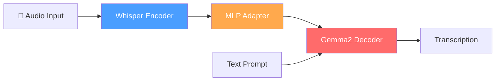
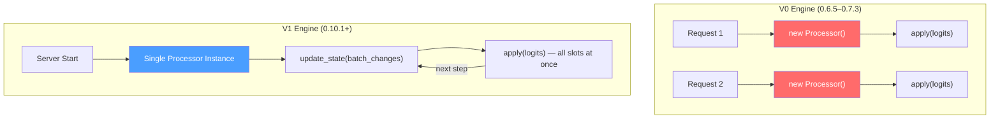
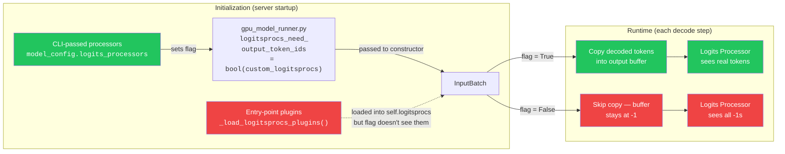

# Migrating an AudioLLM from vLLM 0.6 to 0.16: A War Story

> **TL;DR:** vLLM's V1 entry-point logits processors silently receive `-1`
> placeholder tokens instead of real output when `repetition_penalty=1.0`.
> The bug is in `gpu_model_runner.py`: it computes
> `bool(custom_logitsprocs)` from the CLI-only list and passes the result
> to `InputBatch`, never accounting for entry-point plugins loaded by
> `build_logitsprocs()`. We found it after two days chasing a FlashInfer
> red herring. Short monkey-patch fix included. **This affects any vLLM V1
> entry-point logits processor plugin, not just AudioLLMs** — if your
> processor inspects output token history and `repetition_penalty=1.0`,
> it's silently broken. Affects all standard executor backends (async
> scheduling is the default).

> We're developers on the MERaLiON team who built a vLLM plugin for
> [MERaLiON-2](https://huggingface.co/MERaLiON/MERaLiON-2-10B), a
> 10B-parameter Gemma2-based AudioLLM for multilingual speech recognition.
> Over the past year, we migrated the plugin from vLLM 0.6.5 to 0.16.0 —
> across 3 plugin versions, 2 engine architectures, and 10+ breaking API
> changes. This is what we learned.

---

## 1. Why a Plugin?

MERaLiON-2 is an AudioLLM: a Whisper audio encoder fused with a Gemma2 text
decoder.



vLLM doesn't ship with native support for this architecture, but its
plugin system lets you register custom models without forking the framework.

```toml
# pyproject.toml — the entire integration surface
[project.entry-points."vllm.general_plugins"]
register_dummy_model = "vllm_plugin_meralion2:register"
```

One `register()` function. Load the model class, register it with
`ModelRegistry`, done. Or so we thought.

**Should you build a vLLM plugin at all?** Three options: (a) fork vLLM,
(b) contribute upstream, or (c) write a plugin. We chose (c) to decouple our
release cycle from vLLM's. The cost: absorbing every internal API break
yourself.

---

## 2. The Attention Backend Trap

MERaLiON-2 inherits Gemma2's **attention logit softcapping** — a `tanh`
operation applied inside the attention kernel before softmax
([details](https://arxiv.org/abs/2407.08608)). vLLM's bundled FlashAttention
backend doesn't implement softcapping — using it silently ignores the softcap,
producing numerically incorrect attention weights and degraded transcription
with no error message. FlashInfer does implement it (`logits_soft_cap` is a
first-class kernel template parameter). So for any Gemma2-based model on vLLM,
you **must** use FlashInfer.

How you tell vLLM to use FlashInfer changed between versions: 0.12.x reads
only the `VLLM_ATTENTION_BACKEND` env var; from 0.13.0 the `--attention-backend`
CLI flag was added, and setting *both* causes a `ValueError`. Our serve script
auto-detects:

```bash
ATTN_FLAG=$(python3 -c "
import vllm; from packaging.version import Version
print('--attention-backend FLASHINFER'
      if Version(vllm.__version__) >= Version('0.13.0') else '')
" 2>/dev/null || echo "")

if [ -z "$ATTN_FLAG" ]; then
    export VLLM_ATTENTION_BACKEND=FLASHINFER   # 0.12.x
else
    unset VLLM_ATTENTION_BACKEND               # 0.13+
fi

vllm serve $model $ATTN_FLAG ...
```

---

## 3. The Multimodal API Treadmill

vLLM's multimodal interface changed in every minor release. Here's what broke:

| Version | What changed |
|---------|-------------|
| 0.12 | `merge_multimodal_embeddings` removed; `sampling_metadata` param removed from `compute_logits`; `get_multimodal_embeddings` deprecated → `embed_multimodal`; `mm_options` kwarg added to `get_dummy_inputs` |
| 0.13 | `get_multimodal_embeddings` deleted |
| 0.16 | `BaseDummyInputsBuilder` moved from `multimodal.profiling` to `multimodal.processing`; `MultiModalKwargs` replaced by `MultiModalKwargsItems`; `_get_data_parser()` on processor now raises `ValueError` — must override `get_data_parser()` on `ProcessingInfo` instead |

We handle all of this with defensive imports (`try/except ImportError`) and
version-conditioned patching. The nastiest was the `_get_data_parser` move: we
override `get_data_parser()` on `ProcessingInfo` (for 0.16+) *and* set
`self.data_parser` in the processor's `__init__` (for 0.12–0.15):

```python
# ProcessingInfo.get_data_parser(): called by vLLM 0.16+ via cached_property
def get_data_parser(self) -> MultiModalDataParser:
    feature_extractor = self.get_feature_extractor()
    return MultiModalDataParser(target_sr=feature_extractor.sampling_rate)

# MERaLiON2MultiModalProcessor.__init__(): sets instance attr for vLLM 0.12–0.15
def __init__(self, info, dummy_inputs, *, cache=None):
    super().__init__(info, dummy_inputs, cache=cache)
    feature_extractor = self.info.get_feature_extractor()
    self.data_parser = MultiModalDataParser(target_sr=feature_extractor.sampling_rate)
```

---

## 4. The Logits Processor Rewrite: V0 → V1

MERaLiON-2's transcription quality depends on a **NoRepeatNGram logits
processor** (n=6) that bans repeated token sequences, preventing runaway
repetition loops in autoregressive ASR.

In V0 (0.6.5–0.7.3), this was loaded via the `--logits-processor-pattern` CLI
flag. In V1 (0.10.1+), per-request processors are gone — replaced by
entry-point plugins:



The V1 processor is instantiated **once** at startup and manages the entire
batch through `update_state`/`apply`:

```python
class NoRepeatNGramV1LogitsProcessor(LogitsProcessor):
    def __init__(self, vllm_config, device, is_pin_memory):
        self.ngram_size = int(os.environ.get("MERALION_NGRAM_SIZE", "6"))
        self._slot_data: dict[int, tuple[list[int], list[int]]] = {}

    def is_argmax_invariant(self) -> bool:
        return False  # we can ban the greedy-argmax token

    def update_state(self, batch_update: BatchUpdate) -> None:
        for idx in batch_update.removed:
            self._slot_data.pop(idx, None)
        for idx, _params, prompt_tok_ids, output_tok_ids in batch_update.added:
            self._slot_data[idx] = (prompt_tok_ids or [], output_tok_ids)
        for adx, bdx, direction in batch_update.moved:
            if direction == MoveDirectionality.SWAP:
                self._slot_data[adx], self._slot_data[bdx] = (
                    self._slot_data.get(bdx, ([], [])),
                    self._slot_data.get(adx, ([], [])))
            else:
                self._slot_data[bdx] = self._slot_data.pop(adx, ([], []))

    def apply(self, logits: torch.Tensor) -> torch.Tensor:
        for slot_idx in range(logits.shape[0]):
            if slot_idx not in self._slot_data:
                continue
            prompt_toks, output_toks = self._slot_data[slot_idx]
            all_toks = list(prompt_toks) + list(output_toks)
            # ... compute banned n-grams, set logits to -inf ...
        return logits
```

We tested on 0.12.0–0.14.0. All green. Then we upgraded to vLLM 0.15.0.

---

## 5. The Silent Failure (The Bug)

### What we saw

vLLM 0.15.0 upgrades FlashInfer from 0.5.3 to 0.6.x. After the upgrade,
some audio samples entered **runaway greedy-decoding loops** — the model
repeating the same phrase thousands of times. WER on affected samples exceeded
100%.

No errors. No warnings. The logits processor was loaded, `apply()` was called
every decode step, and it returned the logits untouched.

### What we thought

FlashInfer 0.6.x enables FA3 kernel auto-selection on H100, producing slightly
different attention outputs. We hypothesized the numerical differences pushed
marginal samples past a repetition tipping point. Setting
`repetition_penalty=1.05` (instead of 1.0) "fixed" the loops — which seemed to
confirm the FlashInfer theory.

We capped the supported range at `<0.15.0` and opened a separate branch.

### What was actually happening

Two days later, we added logging inside `apply()`:

```
slot 0 output_toks: [-1, -1, -1, -1, -1, -1, -1, -1, ...]
```

**Every token was `-1`.** The processor was looking at an empty history.

### The root cause



The bug originates in `gpu_model_runner.py`:

```python
# gpu_model_runner.py — the caller sets the flag
logitsprocs_need_output_token_ids = bool(custom_logitsprocs)
# ...
self.input_batch = InputBatch(..., logitsprocs_need_output_token_ids=logitsprocs_need_output_token_ids)
```

`custom_logitsprocs` comes from `model_config.logits_processors` — the CLI list
only. Entry-point plugins **are** loaded by `_load_logitsprocs_plugins()` inside
`build_logitsprocs()` and attached to `self.logitsprocs` — but the flag is
evaluated from the CLI list as a separate kwarg. **It never sees entry-point
plugins.**

When the flag is `False` and all penalties are neutral (`no_penalties=True`),
vLLM's async scheduling path appends `-1` placeholders instead of real tokens.
The repair path only runs when the flag is `True`.

### Why `repetition_penalty=1.05` masked the bug

When any penalty is non-neutral, vLLM enables output token tracking for the
penalty computation — which *as a side effect* populates the same buffer our
processor reads.

```
rep_penalty=1.0   → no_penalties=True  → buffer = [-1, -1, ...] → BROKEN
rep_penalty=1.05  → no_penalties=False → buffer = [real tokens]  → works (by accident)
```

The processor was broken on *every* version with neutral penalties. FlashInfer
0.6.x just changed the probability distribution enough to expose it.

**The FlashInfer upgrade was correlated with the bug appearing, but it wasn't
the cause.**

### The fix

We patch `InputBatch.__init__` — a stable interception point where
`self.logitsprocs` is already attached:

```python
def _patch_logitsprocs_output_token_tracking():
    try:
        from vllm.v1.worker.gpu_input_batch import InputBatch
    except ImportError:
        return  # vLLM version without V1 InputBatch
    _orig_init = InputBatch.__init__

    def _patched_init(self, *args, **kwargs):
        _orig_init(self, *args, **kwargs)
        if (hasattr(self, "logitsprocs")
                and self.logitsprocs.non_argmax_invariant
                and not self.logitsprocs_need_output_token_ids):
            self.logitsprocs_need_output_token_ids = True

    InputBatch.__init__ = _patched_init
```

**This bug is not MERaLiON-specific.** Any vLLM V1 entry-point logits
processor that depends on output token history (i.e. returns
`is_argmax_invariant() = False`) will silently receive `-1` placeholders
when all penalties are neutral. If you maintain a vLLM logits processor
plugin, check whether your processor reads output tokens — if it does,
you likely need this patch or the upstream fix.

**Caveat**: this patches a private class. The `hasattr` guard fails silently if
the attribute is removed. The proper upstream fix is to re-evaluate the flag *after*
`build_logitsprocs()` returns, using
`bool(logitsprocs.non_argmax_invariant)`. We're preparing an upstream
PR to fix this in vLLM.

With this patch, all 6 vLLM versions (0.12.0–0.16.0) pass full-dataset ASR
evaluation (1,575 samples, 7 datasets, 4 languages) with stable WER (±0.001)
under greedy decoding.

---

## 6. The Compatibility Matrix

After this incident, we built an automated matrix runner that, for every
`(vLLM, transformers)` pair, creates an isolated venv, starts the server, runs
unit tests + full ASR evaluation, and tears down — including force-killing
orphaned `VLLM::*` processes that survive the parent.

All tested against `transformers==4.57.6` on H100 (TP=1). The full
evaluation covers 1,575 samples across 7 datasets and 4 languages
(English, Chinese, Malay, Tamil). Three representative datasets shown
below; all 7 pass with WER within threshold on every version. Full
results in the
[repository](https://github.com/YingxuH/vllm_plugin).

| vLLM | English (n=384) | Chinese (n=206) | Tamil (n=184) | Status |
|------|----------------|----------------|--------------|--------|
| 0.12.0 | 0.088 | 0.162 | 0.330 | PASS |
| 0.13.0 | 0.088 | 0.162 | 0.331 | PASS |
| 0.14.0 | 0.088 | 0.162 | 0.330 | PASS |
| 0.15.0 | 0.088 | 0.162 | 0.331 | PASS |
| 0.15.1 | 0.088 | 0.162 | 0.330 | PASS |
| 0.16.0 | 0.088 | 0.162 | 0.330 | PASS |

---

## 7. What We'd Tell You Before You Start

**Log your processor's inputs, not just its outputs.** We would have caught the
`-1` placeholders on day one instead of chasing FlashInfer for two days.

**Automate the version matrix early.** We found breaking changes in *every
single minor release*. Ours takes 3 hours to run; it has saved more than that.

**Treat "unrelated parameter fixes" as red flags.** `rep_penalty=1.05` "fixed"
our bug by accidentally enabling an unrelated code path. When a parameter
change fixes a seemingly unrelated problem, the real bug is still there.

---

## The Plugin

[vllm-plugin-meralion2](https://github.com/YingxuH/vllm_plugin) — open source,
supports vLLM 0.12.0–0.16.x, tested on H100.

---

*Tags: vLLM, LLM serving, AudioLLM, speech recognition, MLOps, debugging*
